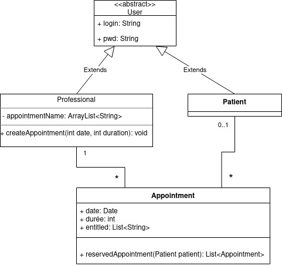

# Rapport TP 1 de TAA

Pour ce qui est du diagramme de classe, je suis resté sur quelque chose de basique comme on peut le voir.

Pour le système de réservation je suis parti du principe que c'était le professionel qui décidait de créer les rendez-vous en leurs donnant une date sans horaire précise, ce qui fait qu'il pourra créer un certain nombre de rendez-vous par jour avec une durée défini pour chaque rendez-vous.

Il est possible pour les patients de consulter tout les rendez-vous qui n'ont pas encore été réservé par d'autre patient.

Pour pouvoir remplir les tables il faut lancer la classe JpaTest.
